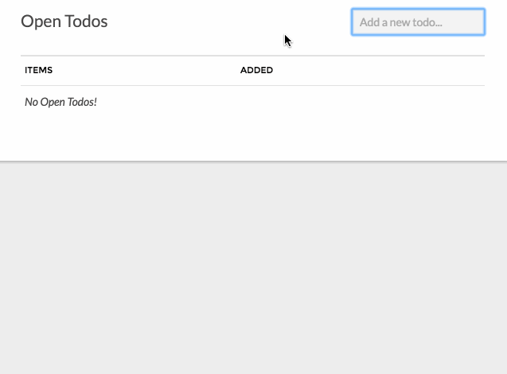

#Todo - A Statamic Addon*
Todo is an exploration into addon development for Statamic v2, which is now built on [Laravel](http://laravel.com). To read the companion blog article, which outlines the process of Todo's creation, please jump over to the [Zaengle blog](http://bit.ly/1SBTZlM)!



##Installation & Configuration
 1. Download the files and place the `Todo` folder within your `sites/addons` directory.
 2. Configure the addon via the control panel, or by adding a `todo.yaml` to the `site/settings/addons` folder.

You may change the word that Todo uses to something else, such as "Task" or "Job" by visiting the addon configuration in the control panel, or by updating the `todo.yaml` file located in `site/settings/addons` directory.

##Managing Todos
Once you have installed the addon you will see an additional navigation item in the sidebar of the control panel. Following this link will take you to the location where you add/complete/delete todos.

##Dashboard Widget

Todo offers a widget that will display a specific number of open Todos on the control panel dashboard. Set it up by adding the following to the `Settings -> Control Panel -> Widgets` section:

```
- 
  type: todo
  title: Todo
  limit: 3
```

##Template Tag

If you would like to display open Todos in your templates, you may do so with this tag:

```
<ul>
    {{ todo:show_open }}
        <li>{{ todo_title }} - {{ todo_added }}</li>
    {{ /todo:show_open }}
</ul>
```

###Notes
**This addon is intended as an exploration into Statamic addon development, and is not a production-ready. We may get get there someday, but it's not ready yet :-)*